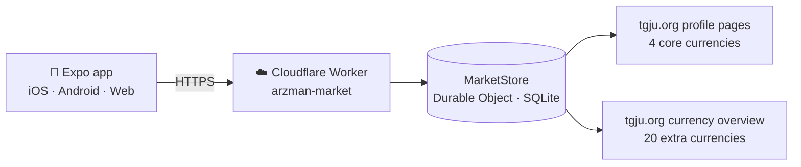

<div align="center">


<br>

[English](README.md) &nbsp;·&nbsp; **فارسی**

<br>

[](https://github.com/karimialireza405/arzman-app/actions/workflows/ci.yml)


</div>

<div dir="rtl">

<div align="center">

### نبض بازار آزاد، در دستان شما

داشبورد لحظه‌ای ارز بازار آزاد ایران؛ با طراحی فارسی‌محور<br>
نرخ ۲۴ ارز · مبدل · هشدار قیمت · نرخ شخصی — برای آیفون، اندروید و وب

[امکانات](#امکانات) · [نحوه کار](#نحوه-کار) · [شروع سریع](#شروع-سریع) · [API](#api) · [مستندات](#مستندات)

</div>

<br>

## چرا «ارز من»

«ارز من» یک راه آرام، سریع و قابل‌اعتماد برای دنبال کردن بازار آزاد است و روی سه قول بنا شده:

| | |
|---|---|
| **داده صادقانه** | قیمت هرگز ساخته، درون‌یابی یا حدس زده نمی‌شود. هر نرخ پیش از ذخیره از نظر واحد، اندازه لات و مرتبه بزرگی اعتبارسنجی می‌شود و هر چیز مشکوک حذف می‌شود، نه نمایش. نمودارها فقط نمونه‌های واقعی را نشان می‌دهند. |
| **طراحی فارسی‌محور** | تایپوگرافی وزیرمتن با ارتفاع خط اندازه‌گیری‌شده، چیدمان راست‌به‌چپ دستی، سوییچ تومان/ریال و ارقام فارسی/لاتین، و حالت تاریک/روشن/سیستم. |
| **اجرا بدون هزینه** | بدون API پولی، بدون حساب کاربری، بدون تبلیغ. یک Worker کوچک روی Cloudflare صفحات عمومی [TGJU](https://www.tgju.org) را می‌خواند و در پلن رایگان جا می‌شود. |

## امکانات

- **۲۴ ارز** با پرچم گرد — USD، EUR، AED، GBP، TRY، IQD، CNY، CAD، AUD، CHF، JPY، SAR، QAR، OMR، KWD، BHD، RUB، INR، AFN، AZN، AMD، GEL، MYR، THB.
- **مبدل** بین هر دو ارز، تومان و ریال، با انتخابگر قابل جست‌وجو.
- **لیست بازار** با جست‌وجو و فیلتر منطقه‌ای، و صفحه جزئیات با نمودار تاریخچه واقعی (۱ ساعت · ۱ روز · ۱ هفته · ۱ ماه · ۳ ماه · ۱ سال).
- **هشدار قیمت** — بالاتر / پایین‌تر، تغییر روزانه و حرکت سریع — تا زمانی که اپ باز است.
- **نرخ شخصی** — نرخ صرافی خودتان یا تتر، در مقایسه با بازار آزاد.
- **حس بومی روی هر پلتفرم** — تب‌بار سیستمی iOS با Liquid Glass، تب‌بار شیشه‌ای شناور روی اندروید و وب، لرزش لمسی و پشتیبانی از Reduce Motion.
- **نصب روی آیفون از Safari** (*Add to Home Screen*) — بدون حساب توسعه‌دهنده اپل.

## نحوه کار



اپ فقط با Worker خودمان صحبت می‌کند. یک Durable Object سراسری، به‌روزرسانی‌ها را پشت سر هم اجرا می‌کند، هر نرخ را اعتبارسنجی می‌کند، وقتی منبع در دسترس نیست **آخرین نسخه سالم** را نگه می‌دارد و مشاهده‌هایی ثبت می‌کند که نمودار تاریخچه از آن‌ها ساخته می‌شود.

**اعتبارسنجی، خلاصه.** برای چهار ارز اصلی، نرخ زنده، جدول خلاصه و پرسش‌های متداول هر واحد باید با هم هم‌خوان باشند. بیست ارز دیگر به ردیف تأییدشده دلار لنگر می‌شوند، فقط با اندازه لات صریح پذیرفته می‌شوند و با نرخ برابری بلندمدتشان سنجیده می‌شوند (که خطای ۱۰ یا ۱۰۰ برابری را می‌گیرد). ردیفی که رد شود حذف و لاگ می‌شود؛ صفحه‌ای که لنگر را رد کند کامل کنار گذاشته می‌شود. جزئیات در [docs/ARCHITECTURE.md](docs/ARCHITECTURE.md).

### ساختار مخزن

</div>

```text
apps/mobile        Expo Router app — screens, UI kit (src/components), design tokens
packages/shared    Zod schemas, normalisation, conversion and alert rules (app + Worker)
server             Cloudflare Worker + one SQLite Durable Object, TGJU providers and parsers
docs               Architecture, research, audits, install guides, history
scripts            API audit and live-source verification
```

<div dir="rtl">

### فناوری‌ها

| لایه | فناوری |
|---|---|
| اپ | Expo SDK 57 · React Native 0.86 · Expo Router · TypeScript (strict) |
| منطق مشترک | طرح‌های Zod و TypeScript خالص — یک پیاده‌سازی برای اپ و سرور |
| بک‌اند | Cloudflare Workers · Durable Objects (SQLite) |
| کیفیت | Vitest · ESLint · `tsc` · GitHub Actions (typecheck، lint، تست، خروجی Android و وب) |

## شروع سریع

پیش‌نیاز: **Node.js 24 LTS** و Git. فقط npm — lockfile‌ها را قاطی نکنید.

</div>

```bash
git clone https://github.com/karimialireza405/arzman-app.git
cd arzman-app
npm ci
npm run check          # typecheck + lint + tests
```

<div dir="rtl">

API بازار را به‌صورت محلی اجرا کنید و اپ را به آن وصل کنید:

</div>

```bash
npm run server                                        # Worker on http://localhost:8787
cp apps/mobile/.env.example apps/mobile/.env.local    # set EXPO_PUBLIC_API_URL
npm run start                                         # Expo — press w for the browser
```

<div dir="rtl">

اجرا روی گوشی واقعی، ساخت APK یا بسته وب و دیپلوی Worker در [docs/DEVELOPMENT.md](docs/DEVELOPMENT.md) و [docs/DEPLOYMENT.md](docs/DEPLOYMENT.md) توضیح داده شده است.

| دستور | کارکرد |
|---|---|
| `npm run start` | سرور توسعه Expo برای اپ موبایل |
| `npm run server` | اجرای Worker روی `localhost:8787` |
| `npm run check` | typecheck، lint و تست — همان چیزی که CI اجرا می‌کند |
| `npm run verify` | گرفتن منابع زنده TGJU و اعتبارسنجی آن‌ها |
| `npm run build:web -w @arzman/mobile` | خروجی وب در `apps/mobile/dist` |

## API

| Endpoint | خروجی |
|---|---|
| `GET /health` | `{ service, ok }` |
| `GET /api/market` | **v1** — دقیقاً ۴ نرخ اصلی (برای نصب‌های قدیمی ثابت می‌ماند) |
| `GET /api/v2/market` | **v2** — هر ۲۴ نرخ |
| `GET /api/market/:code` | یک نرخ، از بین ۲۴ ارز |
| `GET /api/history/:code?range=1H\|1D\|1W\|1M\|3M\|1Y` | مشاهده‌های واقعی، دسته‌بندی‌شده |

> [!IMPORTANT]
> `GET /api/market` (v1) باید همیشه دقیقاً چهار نرخ برگرداند؛ نصب‌های قبل از نسخه ۰.۲.۰ آن را با طرح چهارنرخی می‌خوانند. داده جدید فقط به `/api/v2/market` اضافه می‌شود.

## مستندات

- [معماری](docs/ARCHITECTURE.md) · [توسعه](docs/DEVELOPMENT.md) · [دیپلوی](docs/DEPLOYMENT.md)
- [راهنمای نصب اندروید](docs/android-install.md)
- [پژوهش TGJU](docs/TGJU-RESEARCH.md) · [قابلیت‌های بومی](docs/NATIVE-CAPABILITIES.md)
- [نقشه راه و کارهای باز](TODO.md) · [تغییرات](CHANGELOG.md)

## داده و محدودیت‌ها

قیمت‌ها از صفحات عمومی TGJU می‌آیند و **فقط برای اطلاع** نمایش داده می‌شوند؛ ممکن است بین صرافی‌ها و در طول روز تفاوت داشته باشند. TGJU زمان معامله را منتشر نمی‌کند، پس اپ فقط زمان *دریافت* داده را نشان می‌دهد و آن را به‌عنوان زمان معامله جا نمی‌زند. هشدارها تا زمان باز بودن اپ کار می‌کنند و ارسال پوش وجود ندارد. «ارز من» هیچ وابستگی رسمی به TGJU ندارد. پیش از هر بازنشر گسترده، شرایط استفاده TGJU را بررسی کنید.

## مشارکت و امنیت

پیش از ارسال pull request فایل [CONTRIBUTING.md](CONTRIBUTING.md) را بخوانید. آسیب‌پذیری‌ها را طبق [SECURITY.md](SECURITY.md) به‌صورت خصوصی گزارش کنید و برایشان issue عمومی باز نکنید.

## مجوز

حق نشر © ۲۰۲۶ علیرضا کریمی. **همه حقوق محفوظ است** — کد برای مطالعه و بررسی عمومی است، اما بدون اجازه کتبی، حق استفاده، کپی، تغییر یا بازنشر آن داده نشده است. جزئیات در [LICENSE](LICENSE).

<div align="center">

<br>

ساخته‌شده توسط **علیرضا کریمی** · [@karimialireza405](https://github.com/karimialireza405) · alirezkarimi0021@gmail.com

</div>

</div>
