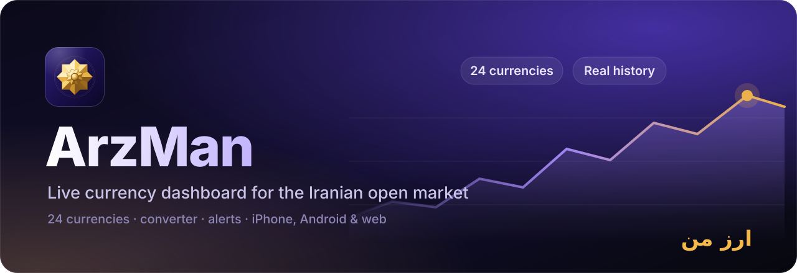
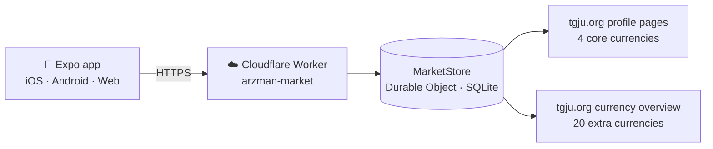

<div align="center">



<br>

**English** &nbsp;·&nbsp; [فارسی](README.fa.md)

<br>

[](https://github.com/karimialireza405/arzman-app/actions/workflows/ci.yml)


[](LICENSE)

### The pulse of the open market, in your hand.

Persian-first, real-time currency dashboard for the Iranian open market.<br>
24 currencies · converter · price alerts · personal rates — on iPhone, Android and the web.

[Features](#features) · [How it works](#how-it-works) · [Getting started](#getting-started) · [API](#api) · [Documentation](#documentation)

</div>

<br>

## Why ArzMan

ArzMan is a calm, fast and trustworthy way to follow the open market. It is built
around three promises:

|  |  |
|---|---|
| **Honest data** | Prices are never generated, interpolated or guessed. Every quote is validated for unit, lot size and magnitude before it is stored; anything uncertain is dropped, not shown. Charts contain only observed samples. |
| **Persian-first design** | Vazirmatn typography with measured Persian line heights, a hand-built RTL layout, Toman/Rial and Persian/Latin digit switching, dark/light/system appearance. |
| **Zero cost to run** | No paid market-data API, no accounts, no ads. One small Cloudflare Worker reads public [TGJU](https://www.tgju.org) pages and fits inside the free plan. |

## Features

- **24 currencies** with round flags — USD, EUR, AED, GBP, TRY, IQD, CNY, CAD, AUD, CHF,
  JPY, SAR, QAR, OMR, KWD, BHD, RUB, INR, AFN, AZN, AMD, GEL, MYR, THB.
- **Converter** between any two currencies, Toman and Rial, with a searchable picker.
- **Market list** with search and region filters, plus a detail screen with a real
  history chart (1H · 1D · 1W · 1M · 3M · 1Y).
- **Price alerts** — above / below, daily change and rapid move — while the app is open.
- **Personal rates** — your exchange's or USDT rate, compared against the open market.
- **Native feel on every platform** — the iOS system tab bar with Liquid Glass, a floating
  glass tab bar on Android and the web, haptics and Reduce Motion support.
- **Installable on iPhone from Safari** (*Add to Home Screen*) — no Apple Developer account.

## How it works



The app only ever talks to our Worker. A single global Durable Object serialises
refreshes, validates every quote, keeps the **last known good snapshot** when the source
is down, and records observations that power the history charts.

**Validation, in short.** Core currencies must agree across the live quote, the summary
table and the per-unit FAQ; extras are anchored to the verified USD row, accepted only
with a stated lot size, and range-checked against their long-run cross rate (which
catches 10× / 100× regressions). A row that fails is dropped and logged; a page that fails
the anchor is rejected whole. Details in [docs/ARCHITECTURE.md](docs/ARCHITECTURE.md).

### Repository layout

```text
apps/mobile        Expo Router app — screens, UI kit (src/components), design tokens
packages/shared    Zod schemas, normalisation, conversion and alert rules (app + Worker)
server             Cloudflare Worker + one SQLite Durable Object, TGJU providers and parsers
docs               Architecture, research, audits, install guides, history
scripts            API audit and live-source verification
```

### Tech stack

| Layer | Technology |
|---|---|
| App | Expo SDK 57 · React Native 0.86 · Expo Router · TypeScript (strict) |
| Shared logic | Zod schemas, pure TypeScript — one implementation for app and server |
| Backend | Cloudflare Workers · Durable Objects (SQLite) |
| Quality | Vitest · ESLint · `tsc` · GitHub Actions (typecheck, lint, tests, Android + web export) |

## Getting started

Requirements: **Node.js 24 LTS** and Git. npm only — do not mix lockfiles.

```bash
git clone https://github.com/karimialireza405/arzman-app.git
cd arzman-app
npm ci
npm run check          # typecheck + lint + tests
```

Run the market API locally and point the app at it:

```bash
npm run server                                        # Worker on http://localhost:8787
cp apps/mobile/.env.example apps/mobile/.env.local    # set EXPO_PUBLIC_API_URL
npm run start                                         # Expo — press w for the browser
```

Running on a physical phone, building an APK or a web bundle, and deploying the Worker
are covered in [docs/DEVELOPMENT.md](docs/DEVELOPMENT.md) and
[docs/DEPLOYMENT.md](docs/DEPLOYMENT.md).

| Command | What it does |
|---|---|
| `npm run start` | Expo dev server for the mobile app |
| `npm run server` | Worker on `localhost:8787` (`wrangler dev`) |
| `npm run check` | Typecheck, lint and tests — what CI runs |
| `npm run verify` | Fetch the live TGJU sources and validate them |
| `npm run build:web -w @arzman/mobile` | Static web build in `apps/mobile/dist` |

## API

| Endpoint | Returns |
|---|---|
| `GET /health` | `{ service, ok }` |
| `GET /api/market` | **v1** — exactly the 4 core quotes (kept stable for older installs) |
| `GET /api/v2/market` | **v2** — all 24 quotes |
| `GET /api/market/:code` | One quote, any of the 24 |
| `GET /api/history/:code?range=1H\|1D\|1W\|1M\|3M\|1Y` | Real observations, bucketed |

> [!IMPORTANT]
> `GET /api/market` (v1) must keep returning exactly four quotes — installs from before
> 0.2.0 parse it with a four-quote schema. New data goes to `/api/v2/market`.

## Documentation

- [Architecture](docs/ARCHITECTURE.md) · [Development](docs/DEVELOPMENT.md) · [Deployment](docs/DEPLOYMENT.md)
- [Android installation guide (Persian)](docs/android-install.md)
- [TGJU research](docs/TGJU-RESEARCH.md) · [Native capabilities](docs/NATIVE-CAPABILITIES.md)
- [Roadmap and open work](TODO.md) · [Changelog](CHANGELOG.md)
- Audits and history: [taste audit](docs/taste-skill-audit.md), [docs/history](docs/history)

## Data and limits

Prices come from public TGJU pages and are shown **for information only**; they can
differ between exchanges and across the day. TGJU publishes no trade timestamp, so the
app reports *retrieval* freshness and never presents it as the trade time. Alerts run
while the app is open; there is no push delivery. ArzMan is not affiliated with TGJU.
Review TGJU's terms before any broad redistribution.

## Contributing and security

Read [CONTRIBUTING.md](CONTRIBUTING.md) before opening a pull request. Report
vulnerabilities privately as described in [SECURITY.md](SECURITY.md) — please do not
open a public issue for them.

## License

[MIT](LICENSE) © 2026 Alireza Karimi — free to use, modify and distribute.

Third-party notices: flag artwork is MIT-licensed
([country-flag-icons](https://github.com/catamphetamine/country-flag-icons)); the Lion
and Sun flag is public domain.

<div align="center">

<br>

Built by **Alireza Karimi** · [@karimialireza405](https://github.com/karimialireza405) · alirezkarimi0021@gmail.com

</div>
